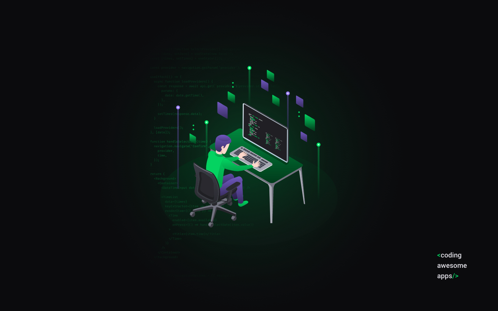
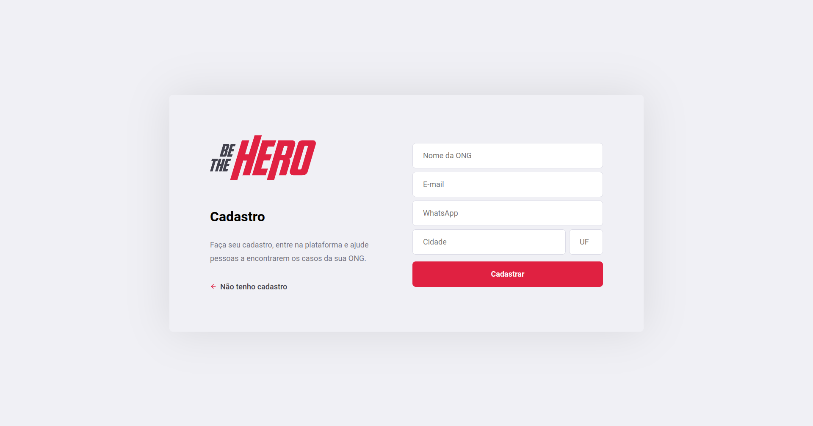
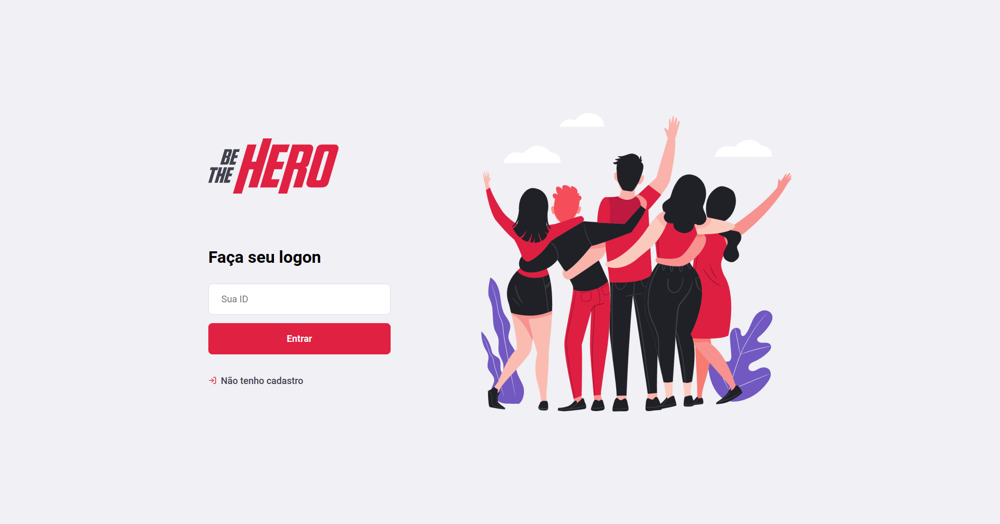
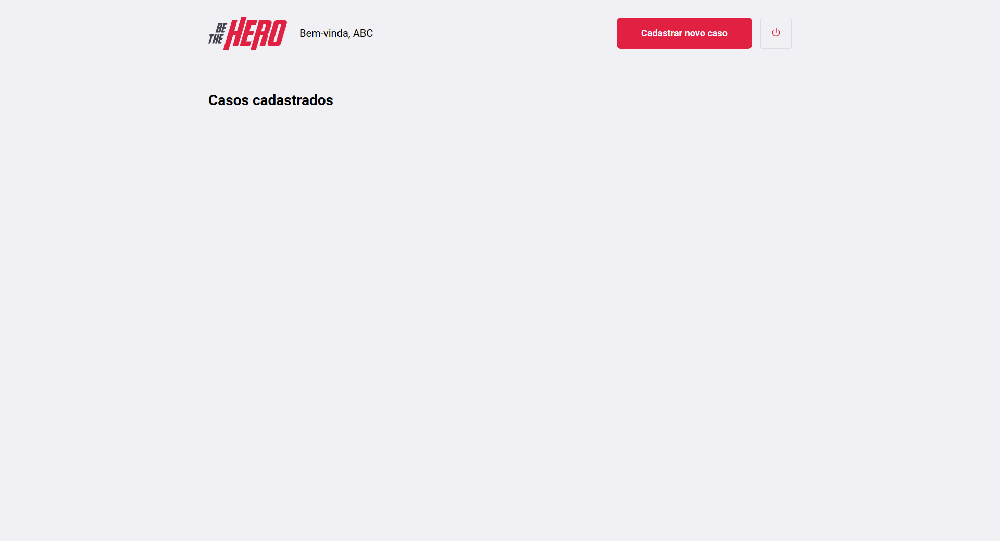
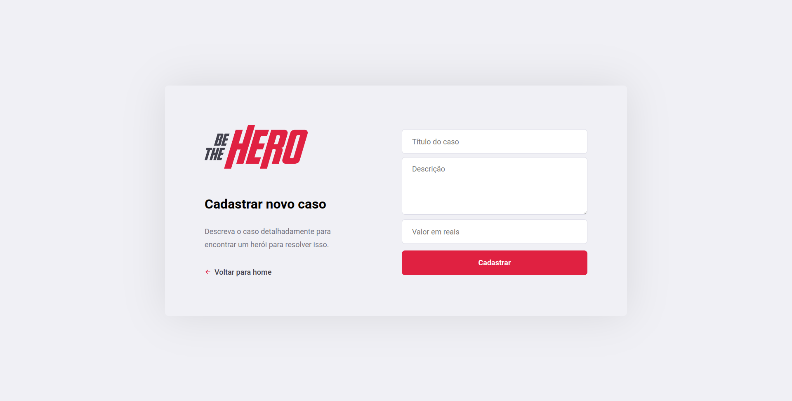
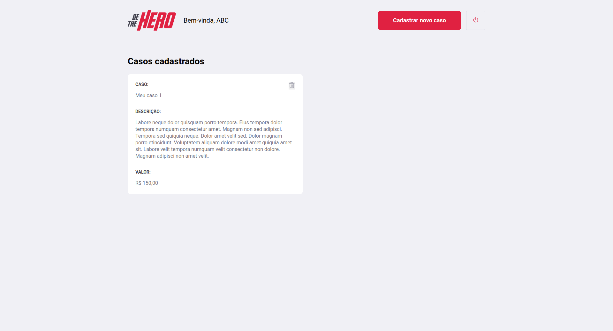
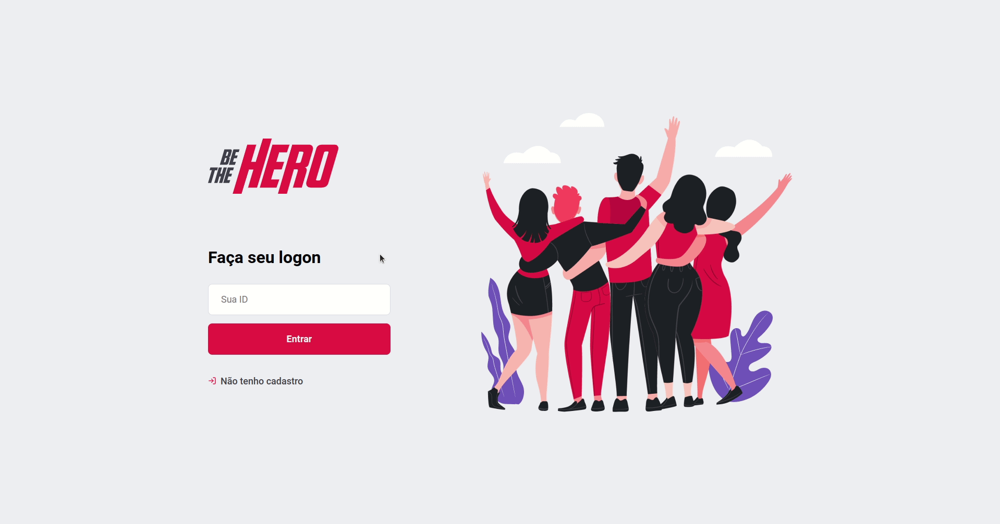
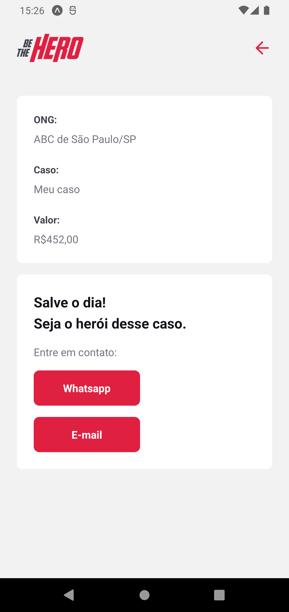

<p align="center">
  
  <br>
</p>
<h3 align="center">
Onde você não precisa de poderes para ser um herói!
</h3>

<p align="center">
  
  
  
  
</p>

<p align="center">
  <a href="#sobre">Sobre</a> •
  <a href="#be-the-hero">Be the Hero</a> •
  <a href="#instalação">Instalação</a> •
  <a href="#tecnologias">Tecnologias</a> •
  <a href="#autor">Autor</a>  
</p>

## Sobre

Projeto desenvolvido durante a semana OmniStack 11, evento criado pela Rocketseat. Um evento 100% online e GRATUITO, com conteúdo exclusivo e INÉDITO.

Ocorreu do dia 25 a 28 de Março de 2020 e teve como intuito mostrar na prática o poder da stack NodeJS + ReactJS + React Native e como essas tecnologias podem te levar até os seus maiores objetivos como programador.



## Be the Hero

O Be the Hero é uma aplicação que tem como objetivo centralizar incidentes intermediados por ONGs para que usuários dispostos a ajudar possam visualizar os casos e entrar em contato com os responsáveis dos anúncios.

A aplicação possuem interface web e mobile, cada qual com suas responsabilidades distintas as quais serão descritas a seguir.

### Be the Hero - Web

A aplicação web é destinada para as ONGs. É através da web que elas realizam seu cadastro na plataforma e cadastram os casos que estão intermediando.

Tudo começa no cadastro da ONG, onde ela informará dados de contato, identificação e localização, conforme ilustrado a seguir:



Após o cadastro ser realizado, o ID da ONG será informado para o usuário, ele deverá anota-lo pois é com ele que os administradores realizam login, o qual ocorre na tela a seguir:



Após informar o ID da ONG, o usuário é direcionado para o painel de administração. É nessa parte do sistema aonde reside o core da plataforma web, é aqui onde os incidentes são exibidos e podem ser criados e excluídos. Na imagem a seguir temos a representação do painel da ONG **ABC**, a qual não possui nenhum incidente cadastrado:



Ao clicar no botão `Cadastrar novo caso`, o usuário é direcionado para o formulário de registro que é exatamente como o exemplo abaixo:



Após inserir as informações e submeter o form, o usuário é direcionado para a home novamente, aonde será exibido o incidente recém criado, conforme ilustrado a seguir:



Com isso, todas as funcionalidades da web foram exploradas e podemos partir para a apresentação do app mobile.
Para ilustrar a aplicação web em funcionamento, deixo o GIF abaixo aonde navego por todas as funcionalidades disponíveis na aplicação:



### Be the Hero - Mobile

A aplicação mobile é destinada para as pessoas que desejam visualizar os casos criados pelas ONGs e ajuda-las na solução. É através do app que os usuários entendem os casos, conhecem os valores necessários e encontram as informações para entrar em contato com os responsáveis.

Ao acessar o app o usuário se depara com a lista dos casos e o total de casos disponíveis (exibido no canto superior direito):


Ao escolher um caso de interesse e clicar no link `Ver mais detalhes`, o usuário irá para a tela que conterá os dados do caso e os deep links para entrar em contato por e-mail e/ou WhatsApp:



Em resumo, esse é o fluxo do app mobile. A seguir deixo um GIF no qual navego pelo app mostrando-o em funcionamento:


## Instalação

Antes de começar, você vai precisar ter instalado em sua máquina as seguintes ferramentas:
[Git](https://git-scm.com), [Node.js](https://nodejs.org/en/).
Além disso é bom ter um editor para trabalhar com o código como [VSCode](https://code.visualstudio.com/).

### 🎲 Rodando o Back End (servidor)

```bash
# Clone este repositório
$ git clone git@github.com:MrRioja/OmniStack-11.git

# Acesse a pasta do projeto no terminal/cmd
$ cd OmniStack-11

# Vá para a pasta backend
$ cd backend

# Instale as dependências
$ npm install
# Caso prefira usar o Yarn execute o comando abaixo
$ yarn

# Execute a aplicação em modo de desenvolvimento
$ npm run dev
# Caso prefira usar o Yarn execute o comando abaixo
$ yarn dev

# O servidor iniciará na porta 3333 - acesse <http://localhost:3333>
```

### 🖥️ Rodando o Front End (Web)

```bash
# Clone este repositório
$ git clone git@github.com:MrRioja/OmniStack-11.git

# Acesse a pasta do projeto no terminal/cmd
$ cd OmniStack-11

# Vá para a pasta frontend
$ cd frontend

# Instale as dependências
$ npm install
# Caso prefira usar o Yarn execute o comando abaixo
$ yarn

# Execute a aplicação em modo de desenvolvimento
$ npm run start
# Caso prefira usar o Yarn execute o comando abaixo
$ yarn start

# O servidor iniciará na porta 3000 - acesse <http://localhost:3000>
```

### 📱 Rodando o App (Mobile)

```bash
# Clone este repositório
$ git clone git@github.com:MrRioja/OmniStack-11.git

# Acesse a pasta do projeto no terminal/cmd
$ cd OmniStack-11

# Vá para a pasta mobile
$ cd mobile

# Instale as dependências
$ npm install
# Caso prefira usar o Yarn execute o comando abaixo
$ yarn

# Execute a aplicação
$ expo start

# Será aberto no terminal o menu do Expo onde poderá scanear o QR Code para executar o app diretamente no seu celular ou as opções de executar no emulador android ou iOS
```

## Tecnologias


<br><br><br><br>

## Autor

<div align="center">

<h1>Luiz Rioja</h1>
<strong>Backend Developer</strong>
<br/>
<br/>

<a href="https://linkedin.com/in/luizrioja" target="_blank">

</a>

<a href="https://github.com/mrrioja" target="_blank">

</a>

<a href="mailto:lulyrioja@gmail.com?subject=Fala%20Dev" target="_blank">

</a>

<a href="https://api.whatsapp.com/send?phone=5511933572652" target="_blank">

</a>

<a href="https://join.skype.com/invite/tvBbOq03j5Uu" target="_blank">

</a>

<br/>
<br/>
</div>
